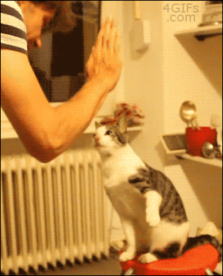

   
# Dark-Kitchen Website

## Description

Dark kitchen is a given project that leads us to master the project management as a team. It's the first project where we are on our own for the desing side, there are no directives towards us such as design aspects. The only directives are about the features that must ensure the website, such as basket management, dark-mode, and filters.  

### Front End

The design side of the project has been created from a template from [Canva]( https://www.canva.com/p/templates/EAE52n9cjzk-neutral-classy-minimalist-restaurant-menu/).  

The body is split into three parts :  

- Header : Name of the shop, filter, and dark mode.
  
- Body : All the  meals available on the menu split by categories such as as starter, main dishes and desserts. You have the possibility of adding the meal you want to the basket when you click on the cart.  

- Footer : Relevant informations heading to the shop owners, such as contact, location, and official website.  We also added links to social media. Finally, the footer also contains the copyright of the website creators (us).

### Back End

The features that are handed by the back end side of the website are the basket manager, the dark-mode and the category filter.  

- Basket Manager : Allow the user to click on a cart next to the item he wants to order, then will add the content to the basket with the price and will return the order of the user with the full price of the items he wants to order.  
- Dark-mode : The dark-mode allows the user to switch from light mode (white) to the dark mode (black) and vice versa. Dark mode has become a web development standard.  
- Category Filter : Allows the user to filter the menu between starter, main dish and desserts. He can then make sure he selected the category he wants with the dropdown menu.  

#### Collaborators  

The project has been created by [BeCode](becode.org) and carried out by Lidwine C, Rosalie B, Valentin L & Robin P.  
